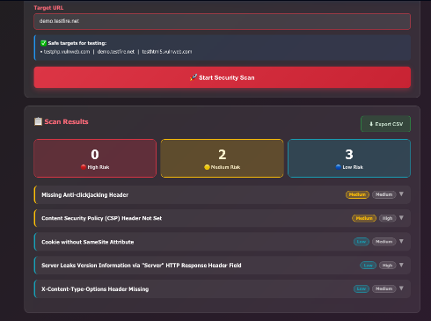

# Web Security Scanner

A local, Dockerised web vulnerability scanner. A Flask backend drives an
OWASP ZAP daemon through its spider, passive, and active scan phases and
serves a single-page frontend that polls for live progress and renders
results by risk level.

> ⚠️ **Ethical use only.** Only scan websites you own or have explicit
> permission to test. Unauthorised scanning is illegal in most jurisdictions.


## How it works

```
Browser (website/security_scanner.html)
        │  fetch /scan, /status, /cancel
        ▼
Flask backend (backend/app.py, backend/scan_manager.py)
        │  ZAP API (no key, local only)
        ▼
OWASP ZAP daemon (Docker container)
```

1. You enter a target URL and hit **Start Security Scan**.
2. The backend validates the target isn't pointing at loopback, link-local,
   or private (RFC1918) address space, then runs the scan on a background
   thread.
3. ZAP spiders the site, runs a passive scan, then an active scan.
4. The frontend polls `/status` every 2s and renders results grouped by
   High / Medium / Low risk, with CSV export.

## Project structure

```
security-scanner-docker/
├── docker-compose.yml
├── README.md
├── backend/
│   ├── Dockerfile
│   ├── app.py            # Flask routes: /, /scan, /status, /cancel
│   ├── scan_manager.py   # ZAP integration, SSRF guard, alert filtering
│   └── requirements.txt
├── website/
│   └── security_scanner.html   # Frontend: form, progress bar, results view
└── images/                     # Screenshots referenced in this README
```

## Setup

Requires Docker Desktop.

```bash
cd security-scanner-docker
docker compose up -d
```

Then open **http://localhost:5001**.

To stop:

```bash
docker compose down
```

## Usage

Enter a target URL and start the scan. Progress moves through three phases —
spidering, passive scan, active scan — and results are grouped by risk with
a description, recommended fix, and CWE/WASC references for each finding.



## Security notes

- **No SSRF via this tool**: `scan_manager.py` resolves the target hostname
  and rejects loopback, link-local, private, reserved, and multicast ranges
  before a scan starts.
- **ZAP and the backend are bound to `127.0.0.1` only** in
  `docker-compose.yml` — not reachable from other machines on your network.
- **No API key on the ZAP daemon.** This is intentional for local-only use
  (`api.disablekey=true`) and is safe *only* because of the localhost
  binding above. Do not remove that binding without adding ZAP API auth.
- **Single scan at a time by design.** The backend rejects a new `/scan`
  request while one is already running (`409`) rather than clobbering
  shared state.
- No data is persisted — results live in memory for the duration of the
  scan and are cleared on the next run.

## Tech

- Backend: Python 3.11, Flask, `python-owasp-zap-v2.4`
- Scanning engine: OWASP ZAP (Docker image, daemon mode)
- Frontend: vanilla HTML/CSS/JS, no build step
- Orchestration: Docker Compose
